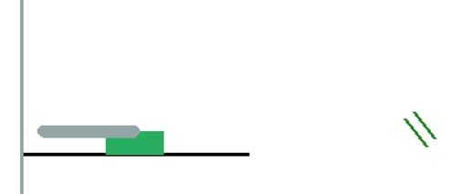

# Robo Dunk

## About

Robodunk is an exercise in visual reinforcement learning: involving training a model and then deploying it in a productionised webapp ([try it here](https://robot-sandbox.xyz/)) hosted on AWS.

## Setup and usage

Install packages using `pip`

`python -m venv venv`

`source venv/bin/activate` (Linux)

`pip install -r requirements.txt`

Use scripts:

Play yourself (difficulty is between 0-1): `python play.py -d 0.5 -s 5000`

View inference: `python view_ppo.py -d 0.2 -s 5000 -m models/ppo_robo_dunk_1919_08112025.zip`

Training: `python train_ppo.py --config train_config.yaml`

Unit tests: `pytest`

## Software Features/Tools

Model was trained using `stable-baselines3` and tensorboard

Frontend is built using streamlit.

App is containerised using Docker and uploaded to an AWS elastic container registry (ECR). The app is hosted on an EC2 instance and served it through my own custom domain https://robot-sandbox.xyz using nginx and Let's Encrypt.

CI/CD is automated via GitHub actions which containerises the code and deploys on the EC2 instance via SSH. Additionally, pre-commits are installed locally including flake8 & black (to do: add to GitHub actions, alongside unit test run)
